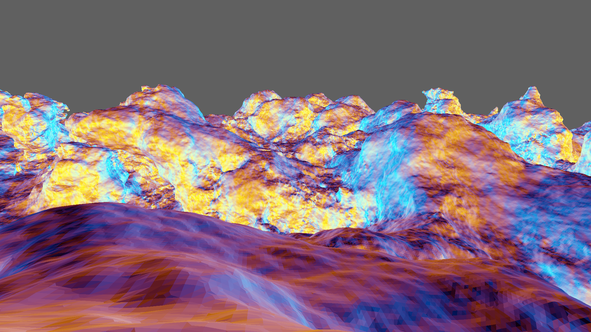
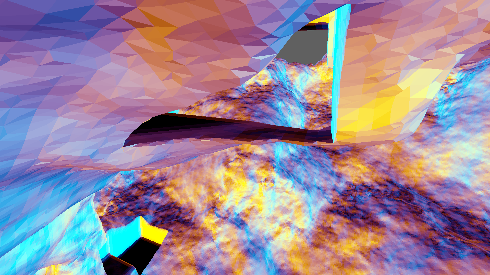
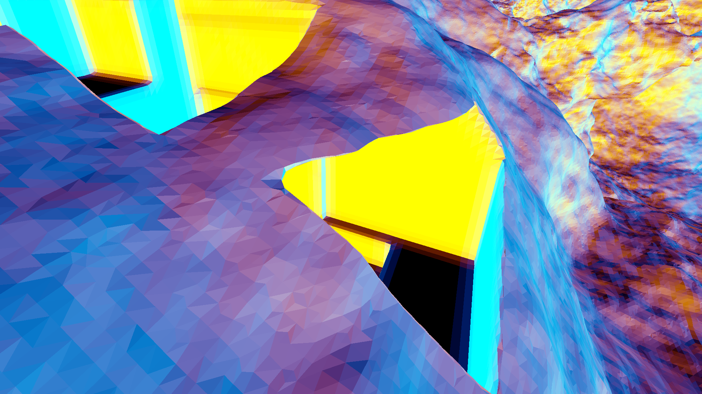

# Dual Contouring

__Project creation date:__ 28.12.2018

## Description
This project generates a randomly generated 3D world with Dual Contouring for the mesh generation. The world is infinite in all 3 dimensions.\
The chunk generation can be done with:
* Multithreaded C++ & SSE2
* GPU and OpenCL.

## Technologies
* C#, C++
* MonoGame
* OpenCL

## Remarks
Running this project is quite expensive for the CPU, GPU and RAM.

## Pictures

